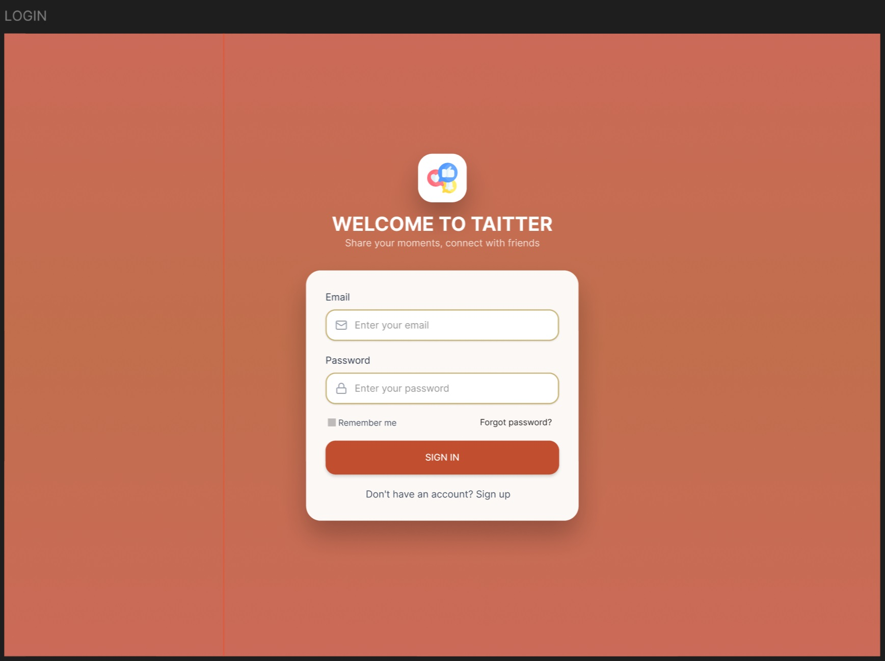
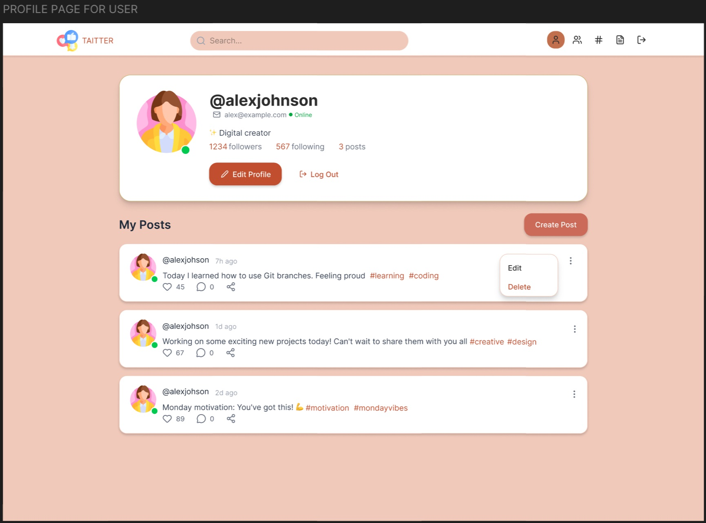
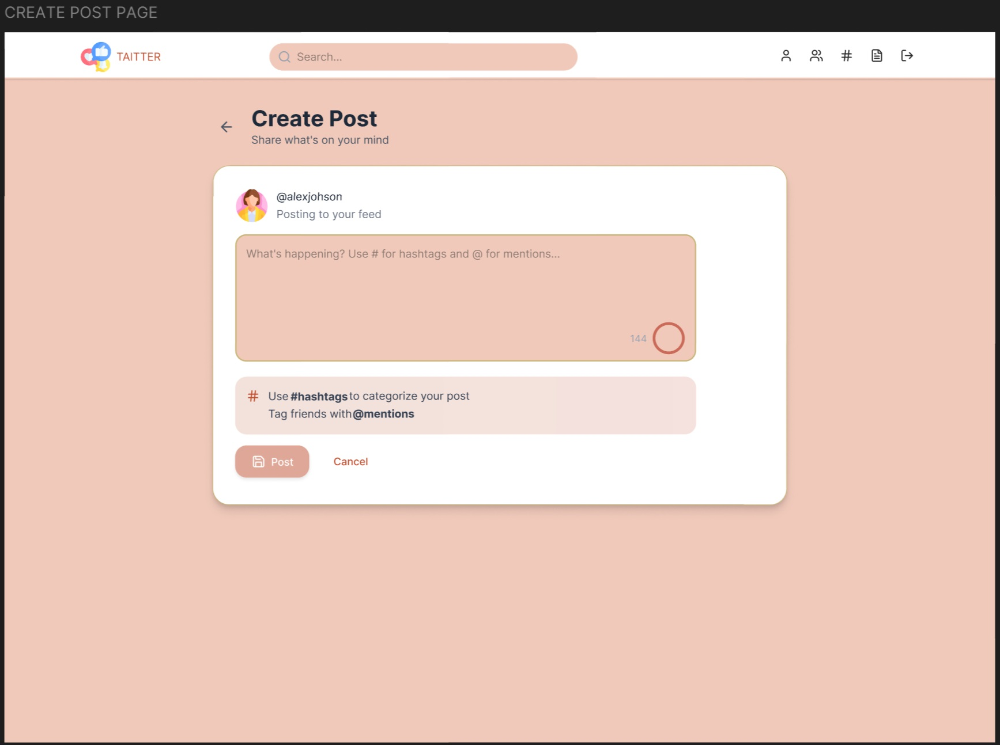
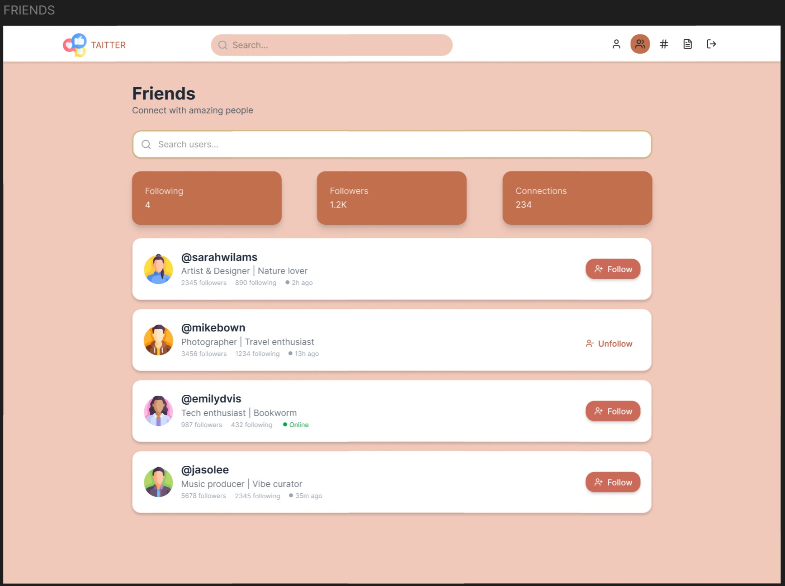
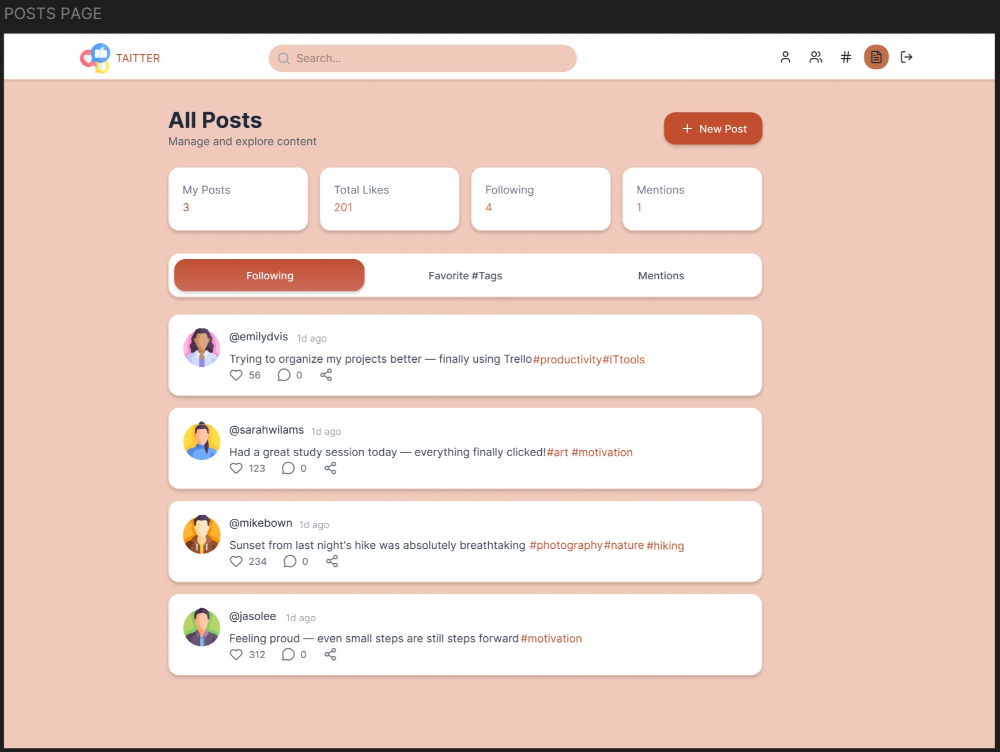
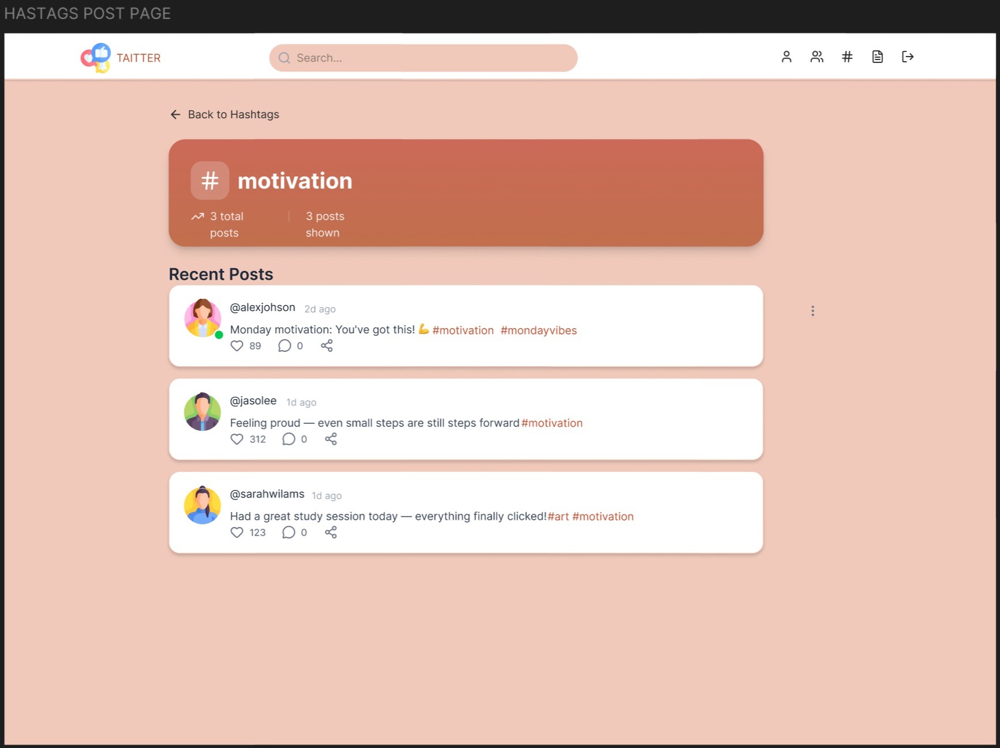

# TAItter – short academic team project

## Project overview
TAItter is a social media web application inspired by Twitter, developed as part of a team assignment during IT studies.
The goal of the project was to design the backend, frontend, and database for a microblogging platform with user interaction features such as posts, hashtags, and mentions. Implement it if time permits.
The project was completed in a team of 4 students, with responsibilities divided among members.

## Application features
- User registration and login
- User profiles with description and activity data
- Creating posts (maximum 144 characters)
- Hashtags (#) and user mentions (@)
- Personalized feed showing:
  * posts containing followed hashtags
  * posts from liked users
  * posts mentioning the user
- Posts displayed in reverse chronological order
- Ability to follow hashtags and users
- Managing followed hashtags and users
- Search functionality by hashtag or username
- User profile view with statistics and posts
- Hashtag view displaying related posts

## Technologies used
- MySQL (phpMyAdmin, XAMPP)
- Figma (UI prototypes)
- HTML / CSS
- PHP
- GitHub for version control

## My contribution
- Creating and configuring the GitHub repository
- Designing and implementing the database structure
- Developing the index page user interface based on Figma prototypes (including CSS styling)
- Preparing the project presentation (PowerPoint)

## Database design

## Running the Project Locally
This project runs in a local environment using PHP and MySQL.

#### Steps to run the project:
- Install a local server environment (for example, XAMPP)
- Import one of the provided `.sql` files into the database
- Configure the database connection in `connection.php`
- Open the project in a browser using `localhost`

The project was developed for local use and is not deployed online.

## Screenshots
### Login page

### Profile page

### Create post page

### Friends list page

### Posts page

### Hashtags page

## Project Status
This project was created for educational purposes as part of IT studies.
It demonstrates basic full-stack development and database design skills.
